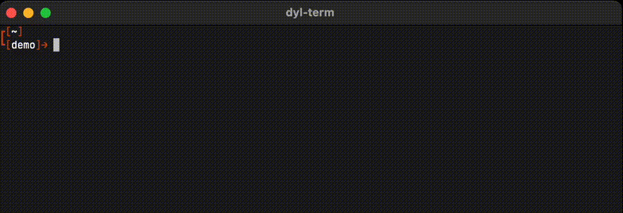

# tally

[](https://crates.io/crates/tally-cli)

A CLI tool to manage global counters from the command line. Written in Rust with SQLite, it's capable of managing interprocess usage and ideal for iterating and templating.



If you have `cargo` on your machine you can quickly get started with the following.

```shell
# Installation (requires Rust, see alternatives below)
cargo install tally-cli

# Init database
tally
```

This will install `tally` in your PATH and after running the `tally` base command, a SQLite database will be initialized for your counters.

## Installation

- cargo support
- docker support
- apt or snap support
- brew support

```
cargo install tally-cli
```

## Detailed Usage

This section describes detailed usage for the `tally` CLI command.

```
A global counter

Usage: tally [OPTIONS] [name] [COMMAND]

Commands:
  set     Set configuration of the provided counter
  add     Increment a given counter
  sub     Decrement a given counter
  delete  Delete a given counter
  list    List all of the active counters
  help    Print this message or the help of the given subcommand(s)

Arguments:
  [name]  Name of counter

Options:
      --raw   Render counter without template (if template is set)
  -h, --help  Print help

```

### Basic Usage

`tally` is designed for for managing counters across your terminal environments. After installation, you can initialize the database with.


```bash
$ tally
0
```

#### update counter

You can start interacting with your counter immediately with the following examples.

```bash
$ tally add
1

$ tally add 10
11

$ tally sub
10
```

#### add counters

Additionally, you can maintain as many counters as you'd like, and view their state with the `tally list` subcommand.

```bash
$ tally maple-syrup
0

$ tally beaver
0

$ tally list
 Name         Count  Step  Template  Default  
 tally        0      1     {}        true     
 maple-syrup  0      1     {}        false    
 beaver       0      1     {}        false    
```

#### remove counters

You're able to delete a single counter with the following.

```bash
$ tally beaver delete
```

### Customize setting

`tally` offers options that can be updated using the `tally set` subcommand. The options include

* *Count*: Set the current value of the provided counter
* *Step*: The amount to step the counter when add/sub is called.
* *Template*: Template to render when the `tally <name>` command is called
* *Default*: Count to render and operate on when the base `tally` command is called without a name.

These examples demonstrate the extent in which these features could be leverage.

#### Updating count and step

```bash
$ tally set --count 50 --step 50

$ tally add
100
```

#### Setting default

```bash

$ tally monkey
0

$ tally add 50
50

$ tally list
 Name         Count  Step  Template  Default  
 tally        50     1     {}        true     
 monkey       0      1     {}        false    

$ tally monkey set --default --count 200 --step 5

$ tally add 
205

$ tally list
 Name         Count  Step  Template  Default  
 tally        50     1     {}        false
 monkey       205    5     {}        true

```

#### Using templates

The templates in `tally` can reference one another, making it easy to start managing complex counting states.

```bash
# '{}' is reserved for render the count.
$ tally set --count 100 --template doody-{}

$ tally cookie
0

# Use the name in '{}', to reference and render another counter
$ tally cookie set --count 200 --template howdy-{tally}-{}

$ tally cookie
howdy-doody-100-200
```

> warning: `tally` will error if trying to reference a non-existent counter.

### Leftovers

Below demonstrates some of the other features pertaining to `tally`.

#### raw

Print the counter value alone if a template is set.

```bash
$ tally set --count 10 --template some-template-{}

$ tally --raw
10
```

#### quiet

Add or subtract from a counter without printing to stdout.

```bash
$ tally add 100 -q # '--quiet' works too
```

#### nuke

A SQLite database is maintained at `~/.tally/tally.db`, you are able to manually delete it or optionally use the `tally nuke` subcommand.

```bash

$ tally list
 Name         Count  Step  Template  Default  
 tally        50     1     {}        false
 sugar        123    3     {}        true


$ tally nuke

Do you wish to nuke the database? (y/n)
y

$ tally list
 Name         Count  Step  Template  Default  
 tally        0      1     {}        true
```


## Acknowledgements

Created by `uhryniuk`. Licensed under the [GPL-3.0 license](LICENSE).

